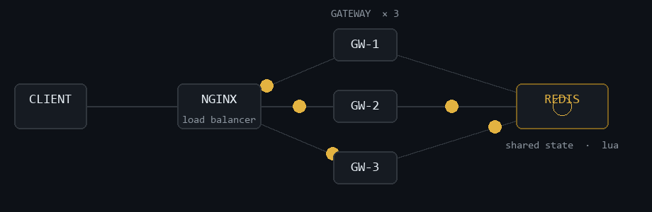

<!--
  Shorya06 — GitHub profile README
  Concept: "SRE Console" — a monitoring surface for one engineer.
  THESIS: The profile reads like the systems it builds: dark console,
  amber instrumentation accents, projects as service cards, real data only.
  FIRST VIEWPORT: name + headline + one status line, the animated
  distributed-system diagram, then a contact strip. One accent (#E3B341).
  Palettes: bg #0d1117 · panel #161b22 · border #30363d · text #e6edf3
            muted #8b949e · accent #E3B341 · healthy #3fb950
-->

<h1 style="font-size: 2.4em; font-weight: 700; margin: 0 0 8px; letter-spacing: -0.02em;">Shorya Tripathi</h1>

Backend engineer building <b>distributed systems</b>, Kubernetes platforms, and AI-powered automation.

●&nbsp; final-year B.Tech CSE &nbsp;·&nbsp; open to backend engineering internships

 

 

<a href="https://github.com/Shorya06">github.com/Shorya06</a> &nbsp;·&nbsp;
<a href="https://www.linkedin.com/in/shoryatri06">linkedin.com/in/shoryatri06</a> &nbsp;·&nbsp;
<a href="mailto:shoryatripathi0606@gmail.com">shoryatripathi0606@gmail.com</a> &nbsp;·&nbsp;
<a href="https://leetcode.com/u/shoryatripathi/">leetcode.com/u/shoryatripathi</a>

 

<h2 style="font-family: ui-monospace, SFMono-Regular, 'SF Mono', Menlo, Consolas, monospace; font-size: 14px; font-weight: 600; letter-spacing: 0.06em; text-transform: uppercase; color: #8b949e; margin: 40px 0 12px; padding-bottom: 8px; border-bottom: 1px solid #21262d;">▸ about</h2>

I build backend systems that stay up under load — and teach them to fix themselves when they don't.

Currently focused on distributed systems, Kubernetes platform engineering, and LLM-driven operations.

<h2 style="font-family: ui-monospace, SFMono-Regular, 'SF Mono', Menlo, Consolas, monospace; font-size: 14px; font-weight: 600; letter-spacing: 0.06em; text-transform: uppercase; color: #8b949e; margin: 40px 0 12px; padding-bottom: 8px; border-bottom: 1px solid #21262d;">▸ featured projects</h2>

<h3 style="margin: 0 0 6px; font-size: 17px; font-weight: 600;"><a href="https://github.com/Shorya06/Distributed-Rate-Limiter">Distributed Rate Limiter &amp; API Gateway</a></h3>

Horizontally scalable API gateway with atomic, cross-instance rate limiting backed by shared Redis.

<ul style="margin: 0 0 10px; padding-left: 20px; color: #e6edf3;">
<li style="margin: 4px 0;">Token-bucket and sliding-window strategies as pluggable Spring Cloud Gateway filters — each check is a single atomic Redis Lua script, so concurrent gateways can never over-admit.</li>
<li style="margin: 4px 0;">3 replicas behind an Nginx load balancer sharing one Redis state; an instance killed mid-load-test failed over with zero downtime.</li>
<li style="margin: 4px 0;">k6 load test: <b>850 req/s at 45ms p95</b>, sustained over 5 minutes.</li>
</ul>

JavaSpring Cloud GatewayRedis · LuaNginxPrometheus + Grafanak6Docker

<h3 style="margin: 0 0 6px; font-size: 17px; font-weight: 600;"><a href="https://github.com/Shorya06/Project-AIOPS">Project-AIOPS — Self-Healing Kubernetes Platform</a></h3>

A closed-loop AIOps platform: 5 microservices that watch Kubernetes, diagnose failures with an LLM, and patch them.

<ul style="margin: 0 0 10px; padding-left: 20px; color: #e6edf3;">
<li style="margin: 4px 0;">Alertmanager alerts and pod crash logs are analyzed by Gemini; structured diagnoses drive whitelisted mutations — confidence-gated replica caps and cooldowns keep the loop safe.</li>
<li style="margin: 4px 0;">Mutates live clusters through the Kubernetes Java client (Strategic Merge Patch, scale subresource) with RBAC-scoped service accounts.</li>
<li style="margin: 4px 0;">React 19 + TypeScript SRE console: live CPU/memory timelines, healing audit drawers, distributed <code>correlationId</code> tracing.</li>
</ul>

Java 17Spring BootKubernetesGemini LLMPostgreSQLPrometheusReact 19

<h3 style="margin: 0 0 6px; font-size: 17px; font-weight: 600;"><a href="https://github.com/Shorya06/UniConnect-Student-Forum">UniConnect — Student Forum &amp; Resource Platform</a></h3>

Full-stack discussion and resource-sharing platform for students and faculty, with role-based access.

<ul style="margin: 0 0 10px; padding-left: 20px; color: #e6edf3;">
<li style="margin: 4px 0;">JWT authentication and RBAC with distinct student / faculty / admin views and capabilities.</li>
<li style="margin: 4px 0;">Posts, comments, likes, and validated resource uploads — built with production habits: loading skeletons, empty states, toasts.</li>
</ul>

React 19Node.jsExpressMySQLJWTTailwind

<h3 style="margin: 0 0 6px; font-size: 17px; font-weight: 600;"><a href="https://github.com/Shorya06/Ast-Code-Optimizer">Ast-Code-Optimizer</a></h3>

A compiler front-end for a C-like language that parses source into an AST and rewrites it through multi-pass optimizations.

<ul style="margin: 0 0 10px; padding-left: 20px; color: #e6edf3;">
<li style="margin: 4px 0;">Flex + Bison lexer/parser, AST builder with Graphviz DOT output, and real optimization passes — constant folding, constant propagation, strength reduction, dead-code elimination — followed by C code generation.</li>
</ul>

CFlexBisonMake

<h2 style="font-family: ui-monospace, SFMono-Regular, 'SF Mono', Menlo, Consolas, monospace; font-size: 14px; font-weight: 600; letter-spacing: 0.06em; text-transform: uppercase; color: #8b949e; margin: 40px 0 12px; padding-bottom: 8px; border-bottom: 1px solid #21262d;">▸ experience</h2>

<h3 style="margin: 0 0 4px; font-size: 17px; font-weight: 600;">Backend Engineering Intern — <a href="https://flyrank.ai/">FlyRank AI</a> · 2026</h3>

Worked through weekly backend stages: REST APIs with OpenAPI/Swagger docs, SQLite → PostgreSQL persistence, Docker Compose orchestration with volumes and connection retries, and Supabase auth integration. <a href="https://github.com/Shorya06/Flyrank-Internship">Internship workspace</a>

<b>Education</b> — B.Tech Computer Science &amp; Engineering, <a href="https://www.geu.ac.in/">Graphic Era University</a>, Dehradun · 2023–2027

<h2 style="font-family: ui-monospace, SFMono-Regular, 'SF Mono', Menlo, Consolas, monospace; font-size: 14px; font-weight: 600; letter-spacing: 0.06em; text-transform: uppercase; color: #8b949e; margin: 40px 0 12px; padding-bottom: 8px; border-bottom: 1px solid #21262d;">▸ open source &amp; systems</h2>

<h3 style="margin: 0 0 4px; font-size: 17px; font-weight: 600;">Home Assistant — <a href="https://github.com/home-assistant/core">home-assistant/core</a> · contributing</h3>

Two CLA-signed PRs in review, aligned with the project's config-flow guidelines: <a href="https://github.com/home-assistant/core/pull/172690">SolarEdge config</a> · <a href="https://github.com/home-assistant/core/pull/172818">Xiaomi Aqara config flow</a>.

<h3 style="margin: 16px 0 4px; font-size: 17px; font-weight: 600;"><a href="https://github.com/Shorya06/xv6-Mini-Kernal-OS">xv6 kernel — MLFQ framework &amp; diagnostics</a> · team lead, 4-member team</h3>

Extended the xv6 kernel with a multi-level feedback-queue scheduling framework, live queue-state diagnostics (<code>mlfqstatus</code>), a <code>getsysinfo</code> syscall, and deadlock-detection infrastructure. C · x86 assembly · QEMU.

<h2 style="font-family: ui-monospace, SFMono-Regular, 'SF Mono', Menlo, Consolas, monospace; font-size: 14px; font-weight: 600; letter-spacing: 0.06em; text-transform: uppercase; color: #8b949e; margin: 40px 0 12px; padding-bottom: 8px; border-bottom: 1px solid #21262d;">▸ achievements &amp; certifications</h2>

<ul style="margin: 0; padding-left: 20px; color: #e6edf3;">
<li style="margin: 6px 0;"><b>300+ DSA problems solved</b> — LeetCode · GeeksforGeeks · CodeStudio</li>
<li style="margin: 6px 0;"><b>AWS Cloud Practitioner Essentials</b> — certified</li>
<li style="margin: 6px 0;"><b>JPMorgan Chase SWE Simulation</b> (Forage) — Kafka messaging on Spring Boot, persisted via Spring Data JPA, verified with acceptance tests</li>
<li style="margin: 6px 0;"><b>Skyscanner Front-End Simulation</b> (Forage) — React date picker with Backpack</li>
<li style="margin: 6px 0;"><b>AWS Skill Builder labs</b> — EC2 · S3 · IAM · VPC</li>
</ul>

<h2 style="font-family: ui-monospace, SFMono-Regular, 'SF Mono', Menlo, Consolas, monospace; font-size: 14px; font-weight: 600; letter-spacing: 0.06em; text-transform: uppercase; color: #8b949e; margin: 40px 0 12px; padding-bottom: 8px; border-bottom: 1px solid #21262d;">▸ stats</h2>

<!-- STATS:BEGIN -->

18

repositories

122+

commits

5

languages

2

OSS PRs in review

auto-refreshed weekly via GitHub Actions &middot; commits &amp; repositories counted across non-fork repos

<!-- STATS:END -->

earlier work &amp; experiments

<ul style="padding-left: 20px; color: #8b949e;">
<li style="margin: 6px 0;">AlgoScope — algorithm benchmarking &amp; visualizer tooling (<b>Python</b>)</li>
<li style="margin: 6px 0;">Smart-Hospital-Management — hospital management system (<b>Python</b>)</li>
<li style="margin: 6px 0;">personality-predictor — ML experiment (<b>Python</b>)</li>
</ul>

